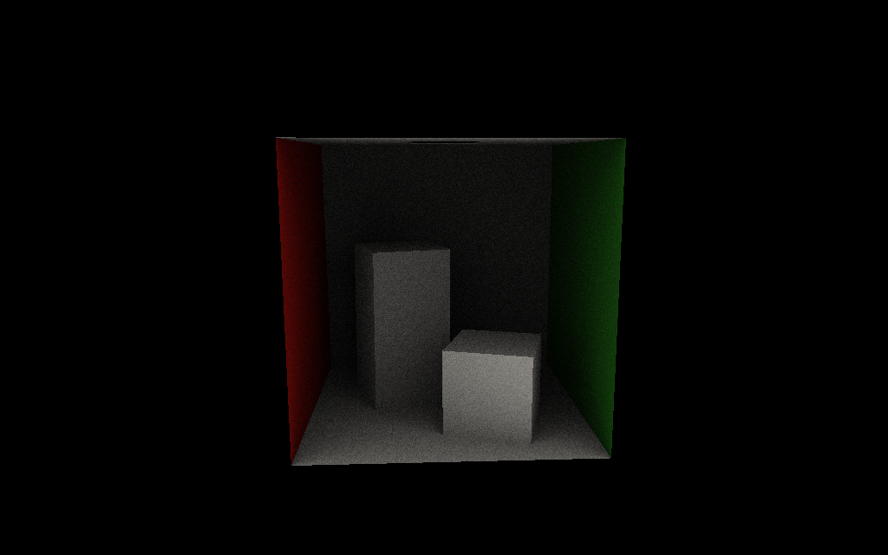

# TP Programmation GPU
## Rapport

Le lancé de rayons est fait sur CPU dans les programmes `ray_tuto` et `tay_tuto_mc`.
Les deux programmes sont sensiblement les mêmes, le shading est ultra basique, seul diffère la façon de calculer les directions de relances de rayons sur une hémisphère.
Dans le premier, la spirale de Fibonacci est utilisée pour calculer ces directions, alors que dans le second, une distribution uniforme est utilisée.
On se rend compte que la spirale de Fibonacci créé des image peu réalistes. Les directions uniformes donnent une images plus réaliste au niveau éclairage ambiant, mais devient bruitée.

Le lancé de rayon en compute shader est fait dans le programme `GPURayTracing`. Une macro permet de choisir entre le lancé de rayons sur CPU et le lancé sur GPU.
Les deux utilisent les mêmes structures de données, notamment un BVH cousu pour être facilement parcouru sur GPU, ces derniers ne supportant pas la récursivité.
Les structures se trouvent dans le fichier `GPUStructs.h`, ainsi que la fonction de transformation du BVH en BVH cousu.
J'aurais pu l'écrire en récursif, mais je ne l'ai pas fait. Ca a été plus compliqué à écrire, et c'est pas forcément bien lisible. Mais ça fonctionne (tant que la racine n'est pas une feuille).
Le compute shader est lancé à l'aide de l'API Vulkan. La classe `ComputeApp` contient tout le code nécessaire à la création des ressources sur GPU.
La gestion mémoire est perfectible, par exemple il y a une allocation de mémoire par buffer.



## Dépendances
La librairie gKit2Light est requise pour compiler les exécutables. Elle est disponible [à cette adresse](https://forge.univ-lyon1.fr/Alexandre.Meyer/gkit2light).
Il faut modifier le chemin d'accès à gkit dans `premake5.lua` avant de générer les fichiers de projet avec premake.

## Build
Éditer `premake5.lua` pour indiquer le chemin vers gkit2light. Exécuter le script à la racine du projet pour générer les fichiers de build et compiler:
```
premake5 gmake2 && make -C build
```
Executer les programmes:
```
./bin/ray_tuto			<- Rendu CPU, 1 rebond (16 relances sur la spirale de Fibonacci)
./bin/ray_tuto_mc		<- Rendu CPU, 1 rebond (16 relances, directions aléatoires)
./bin/GPURayTracing		<- Rendu GPU, 1 rebond (16 relances, directions aléatoires)
```
Pour spécifier un autre mesh, une autre caméra, ou encore un nombre de directions:
```
./bin/GPURayTracing [resources/cornell.obj [resources/cornell_orbiter.txt [16]]]
```
